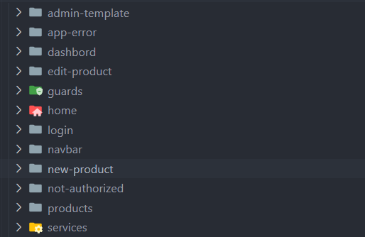
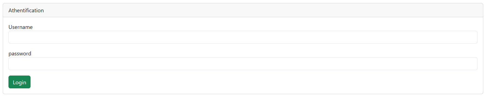
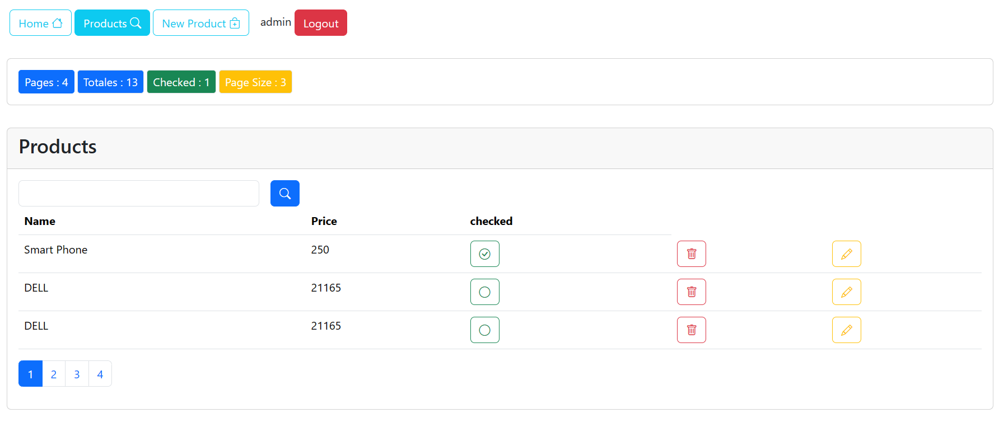
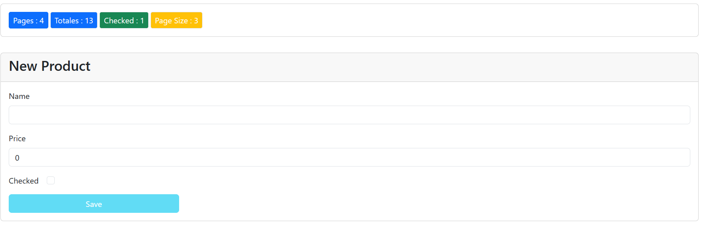
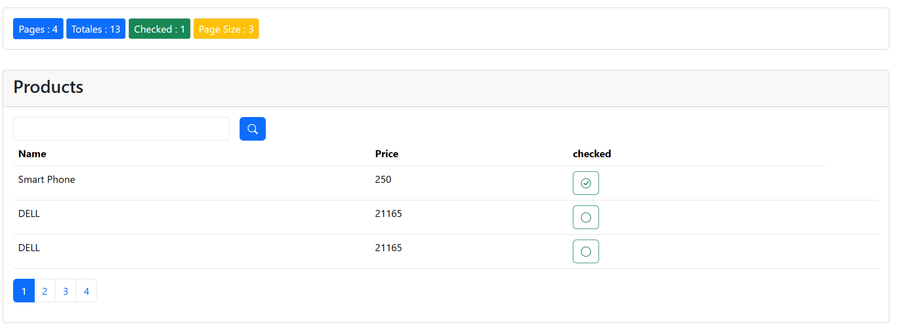
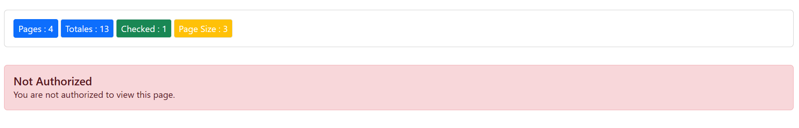

# ProductsApp

Ce projet et un traveaux pratique sur les bases le freamwrok Angulare version 15, il s'agit de la création d'une application web qui permet de gérer les produits par l ajout et la suppression et la modification des produits avec json-server comme API.
Le projet a été généré avec [Angular CLI](https://github.com/angular/angular-cli) version 15.2.11.

## Conceptes abordés
-Notion du  Two way data binding (liaison bidirectionnelle des données).
-Notion de la création des composants.
-Notion de la création des Guards.
-Notion de la création des modules.
-Notion de la protection des routes.
-Notion de Routage
-Notion de architecture d'observables et de services.
-Notion de JWT (JSON Web Token).

## Components

- Products : pour afficher la liste des produits et ces détails
- new-Product : pour ajouter un nouveau produit
- navbare : pour afficher la barre de navigation
- login : pour l'authentification
- not-authorized : pour afficher un message d'erreur si l'utilisateur n'est pas autorisé
- dashbord : pour afficher le tableau de bord
- edit-Product : pour modifier un produit
- admin-template : pour afficher le template de l'admin
- app-error : pour afficher un message d'erreur
- home : pour afficher la page d'accueil

## Services

Dans ce projet j'ai decouvert les services et les observables, j'ai créer  les services  suivants :
- product.service : pour la gestion des produits (ajout, modification, suppression). 
- auth.service : pour l'authentification.
- auth-guard.service : pour la protection des routes.
Pour créer un service, j'ai utilisé la commande `ng generate service service-name`.

## Guards

les Guards sont des services qui permettent de protéger les routes contre l'accès dans certaines conditions. Dans ce projet j'ai utilisé les Guards suivants :
- Authentification.guards : pour protéger les routes contre l'accès des utilisateurs non authentifiés.
- Authorization.guards : pour protéger les routes contre l'accès des utilisateurs non autorisés.
Pour créer un Guard, j'ai utilisé la commande `ng generate guard guard-name`.

## Securité d'application && Api Json-server

Dans cette application, j'ai utilisé la notion de JWT (JSON Web Token) pour l'authentification des utilisateurs. 
Nous l'avons intégré dans notre base de données avec json-server, JSON Web Token (JWT) est un standard ouvert (RFC 7519) qui définit une manière compacte et sécurisée d'échanger des informations entre différentes parties sous forme d'objet JSON. Dans notre application, nous utilisons JWT pour gérer l'authentification des utilisateurs.
Lorsqu'un utilisateur se connecte avec succès, notre serveur génère un JWT qui contient des informations sur l'utilisateur, telles que son identifiant et son rôle. Ce JWT est ensuite renvoyé au client et stocké localement. À chaque requête ultérieure, le client envoie ce JWT dans l'en-tête de la requête pour prouver son identité.
Le serveur vérifie ensuite la validité du JWT en utilisant une clé secrète partagée. Si le JWT est valide, le serveur autorise l'accès à la ressource demandée. Sinon, il renvoie une erreur d'authentification.
L'utilisation de JWT présente plusieurs avantages, notamment la possibilité de gérer l'authentification sans avoir besoin de stocker les informations d'authentification côté serveur. Cela permet de réduire la charge sur le serveur et d'améliorer les performances de l'application.
Dans notre application, nous avons intégré JWT avec json-server, qui est un outil simple pour créer une API RESTful à partir d'un fichier JSON. Cela nous permet de simuler un serveur backend et de gérer l'authentification des utilisateurs en utilisant JWT.
En résumé, l'utilisation de JWT dans notre application nous permet de sécuriser l'authentification des utilisateurs et de gérer l'accès aux ressources de manière efficace et sécurisée.
Vous pouvez trouver les données de l'API dans le fichier `data/db.json`.

## Serveur de développement

Exécutez `ng serve` pour un serveur de développement. Naviguez vers `http://localhost:4200/`. L'application se rechargera automatiquement si vous modifiez l'un des fichiers source.
J'ai utilisé json-server pour simuler un serveur backend. Pour démarrer json-server, exécutez `json-server --watch data/db.json`. L'API sera disponible à l'adresse `http://localhost:3000/`.

## Screen shorts de l'application
-Athentification page : 
    
-Admine session : 
    
    
-User Session : 
    
    
## Génération de code

Exécutez `ng generate component component-name` pour générer un nouveau composant. Vous pouvez également utiliser `ng generate directive|pipe|service|class|guard|interface|enum|module`.

## Construction

Exécutez `ng build` pour construire le projet. Les artefacts de construction seront stockés dans le répertoire `dist/`.

## Exécution des tests unitaires

Exécutez `ng test` pour exécuter les tests unitaires via [Karma](https://karma-runner.github.io).

## Exécution des tests de bout en bout

Exécutez `ng e2e` pour exécuter les tests de bout en bout via une plateforme de votre choix. Pour utiliser cette commande, vous devez d'abord ajouter un package qui implémente les capacités de test de bout en bout.

